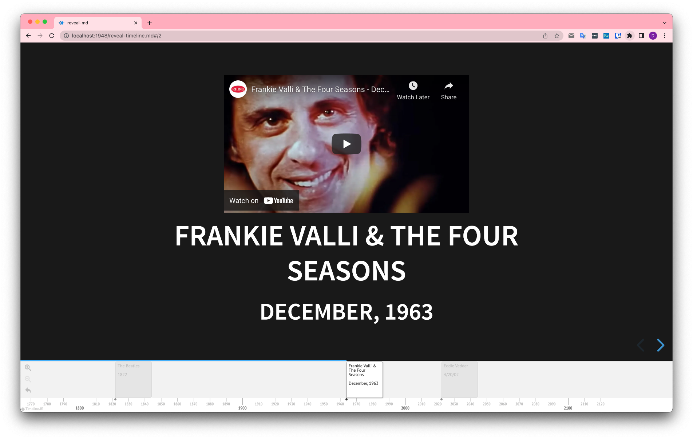

# reveal-timeline

[ ](https://www.npmjs.com/package/reveal-timeline) 
[](https://github.com/dvirtz/reveal-timeline/actions?query=workflow%3ARelease)

A [reveal.js](https://revealjs.com/) plugin for adding a timeline to slides:



Check out the live [demo](https://dvirtz.github.io/reveal-timeline/).

The timeline is generated using [timeline.js](http://timeline.knightlab.com/).

---

## Installation

1. Download and install the package in your project:

    ```
    npm install --save reveal-timeline
    ```

    or

    ```
    yarn add reveal-timeline
    ```

    or just download [dist/reveal-timeline.js](/packages/reveal-timeline/dist/timeline.js) into the plugin folder of your reveal.js presentation, e.g.. `plugins/reveal-timeline`.

2. Add the plugins to the dependencies in your presentation

    ```html
    <script src="node_modules/reveal-timeline/dist/reveal-timeline.js"></script>
    ```

    ```javascript
    // ...
    Reveal.initialize({
      // ...
      plugins: [
          // ...
          RevealTimeline,
      ]
    });
    ```

    If you're using [reveal-md](https://github.com/webpro/reveal-md) you can add a script to load the plugin:

    ```js
    options.plugins.push(RevealTimeline)
    ```

    and then add a reference to this script along with `node_modules/reveal-timeline/dist/timeline.js` to the `scripts` object inside `reveal-md.json` config file. 

For reference, take a look at the [demo](/packages/reveal-timeline-demo) package in this repo.

---

## Usage

The timeline is generated by parsing section data attributes:

| `HTML` attribute | `timeline.js` property | optional | possible values |
|-|-|-|-|
| `data-timeline-start-date` | `start_date` | only for title | [ISO 8601](https://en.wikipedia.org/wiki/ISO_8601) date |
| `data-timeline-end-date` | `end_date` | yes | [ISO 8601](https://en.wikipedia.org/wiki/ISO_8601) date |
| `data-timeline-headline` | `text.headline` |  yes | any text |
| `data-timeline-group` | `group` | yes | any text |
| `data-timeline-display-date` | `display_date` | yes | any text |
| `data-timeline-autolink` | `autolink` | yes | boolean |
| `id` | `unique_id` | yes | a unique string |

If `data-timeline-headline` is not defined, the headline will be a concatenation of all headings in a slide.

In addition, adding the attribute `data-timeline-hidden` to a slide will cause the timeline to be removed from this slide.

For more details, see [timeline.js](https://timeline.knightlab.com/docs/json-format.html#json-slide) documentation.

----

## Configuration

To configure the plugin pass a `timeline` object to `Reveal.initialize` with any of the following options:

| name | purpose | allowed values | default|
| - | -|- | -|
| `position` | timeline position | `'top'` or `'bottom'` | `'bottom'`|
| `height` | timeline height | CSS [\<length>](https://developer.mozilla.org/en-US/docs/Web/CSS/length) or number of pixels | `'140px`|
| `separator` | separator between headline lines | any text | `'<br><br>'`|
